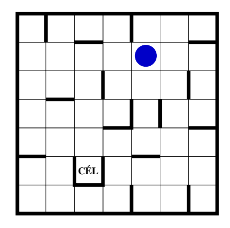

Simple Maze Game
==================
Move the ball to the marked square labeled 'Goal' in the maze depicted in the picture. 
The ball can only move in the four directions: 'up', 'right', 'down', and 'left'. 
Once it starts moving in any direction, it keeps rolling until it hits a wall or the edge of the maze.

# HOW TO START THE GAME
- go into src/main/java/puzzle/game 
- open and run Main.java

## KeyBinds:
- UP -> Move up
- RIGHT -> Move right
- DOWN -> Move down
- LEFT -> Move left
- CTRL + R -> Restart
- CTRL + Q -> Quit
- ENTER -> After entering your name, switch to the Game
- BACK_SPACE -> From the Game switch back to Table

## SOLUTION
1. RIGHT
2. DOWN
3. LEFT
4. DOWN
5. LEFT
6. UP
7. LEFT
8. DOWN
9. LEFT
10. UP
11. RIGHT
12. UP
13. RIGHT
14. UP
15. LEFT
16. DOWN
17. RIGHT
18. DOWN